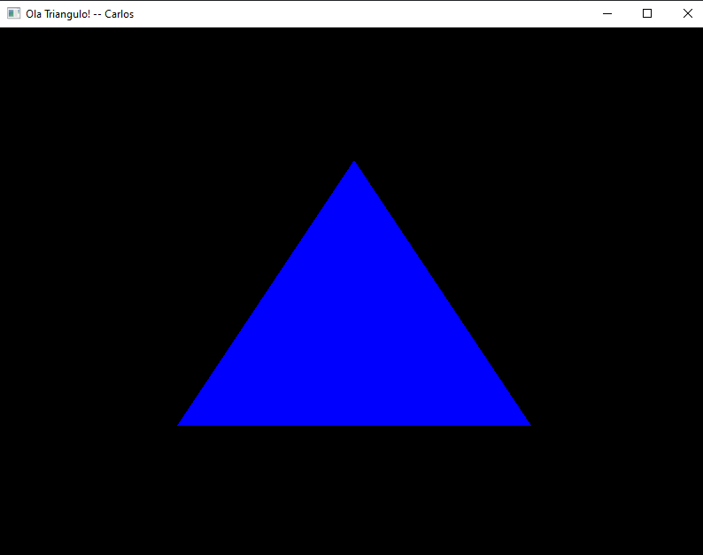

# Development Environment Setup for Graphic Processing

## Activity Description

- **Chosen IDE:** Visual Studio Code (VSCode) was selected for its versatility, extensive support for C++, and seamless integration with the OpenGL API. Its rich ecosystem of extensions has significantly streamlined the development workflow.
- **Utilization of Examples Repository:** Accessed the Code Examples Repository on GitHub, which provided valuable insights and code snippets for starting projects. While these examples were helpful, they were tailored to fit the specific requirements of the tasks.
- **Technical Setup:**
  - **Programming Language:** C++ was used as the primary programming language for this activity, adhering to the task's requirements.
  - **Graphic API:** The development environment supports modern OpenGL (version 3.3 or higher), enabling effective work on graphic processing tasks.

## Proof of Activity

The development environment has been configured as required and is now fully prepared to tackle the programming tasks in Graphic Processing. Below is a screenshot of the VSCode setup, showing the IDE with a sample OpenGL project loaded, demonstrating readiness to proceed with the course's programming activities.

Setting up this environment was an essential step in ensuring readiness with the necessary tools and libraries for the upcoming programming tasks in this course.
